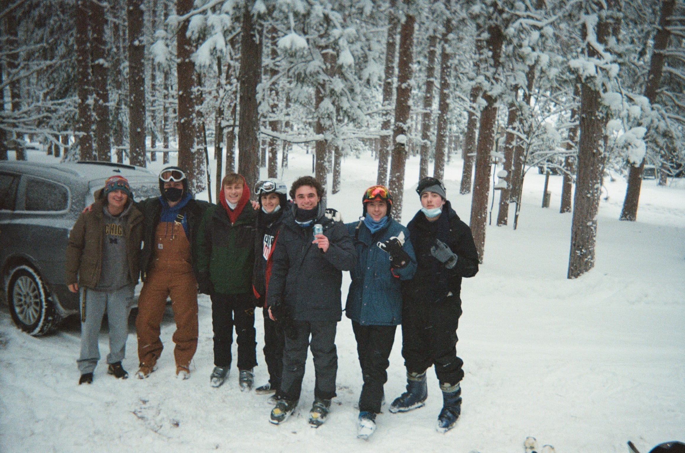

```{r setup, include=FALSE}
knitr::opts_chunk$set(echo = FALSE)
```

```{r, include = FALSE}
# Loading in table and plot creation functions
source("imports_options_constants_functions.R")
source("barplot_ranks.R")
source("best_weeks.R")
source("boxplots.R")
source("extreme_scores.R")
source("histograms.R")
source("scatterplots.R")
source("summary_stats.R")

# Extra libraries, objects, and options for this report

library(patchwork)

library(gridExtra)
tt <- ttheme_default(colhead = list(fg_params = list(parse = FALSE)))

options(knitr.kable.NA = "")
```

```{r}
# rename_quantiles() gives nicer names for the summary_stats() table output
rename_quantiles <- function(df) {
    df %>%
        rename(`Min.` = min,
               `1st Qu.` = quant1,
               Median = med,
               Mean = mean,
               `3rd Qu.` = quant3,
               `Max.` = max) %>%
        {
            if ("trim_mean" %in% colnames(.)) {
                (.) %>%
                    rename(`Trimmed Mean` = trim_mean)
            } else {
                (.)
            }
        }
}
```

```{r}
# kable_nice_names() is a wrapper function for kable::knitr() function, making the column names nices
kable_nice_names <- function(df, digits = 1) {
    df %>%
        knitr::kable(digits = digits, col.names = str_to_title(str_replace_all(names(.), "_", " ")))
}
```

# 1) Introduction



Welcome! For no good justifiable reason, I made some pretty graphs and tables. Fun! This is the first installment of the Sylvan Crossword Reports, which will last until either everyone gets sick of crosswords, everyone hates me, I become sufficiently bored, or people bully me for undertaking this objectively meaningless endeavor.

This installment will cover the first 21 days since data collection began, 12/8/21 - 12/28/21, with the participants in this exercise, henceforth being called by their names in the New York Times crossword app, being Anna (annabeans), Bahs (Bahsdaddy), Charlie (Cnewt), Spank (crossword spank), Ellie (elliefich), Henry (grapefruit jones), Liam (liam), Mike Dale (mike dale), and Barnes (mikemikemike). I thought about including my mom in this exercise, but quite frankly she thoroughly kicked all of our asses, much to her delight, finishing in first place 15 of the 21 days.

The main statistics I look at in this analysis are time to crossword completion, z-scores of time to completion, and daily ranks among the 9 participants. For those who do not know, and because I like to ramble about stats concepts, a z-score is a data transformation that standardizes data to a Standard Normal Gaussian distribution (standard bell shape). Many distributions found in nature are assumed (correctly) to follow a Normal distribution. To amend a canonical example, consider:

* Puzzle A
  + Average solve time of 60 seconds to complete
  + You complete in 70 seconds
  + Your z-score is positive, as your solve time is above the mean
* Puzzle B
  + Average solve time of 150 seconds to complete
  + You complete in 130 seconds
  + Your z-score is negative, as your solve time is above the mean
  
Despite Puzzle B taking you longer to complete, you actually did "better" on that puzzle once we account for its observed difficulty, as you had a lower z-score on Puzzle B than Puzzle A. For further reading, if your into statistical theory and that whole jazz, take STATS 250 or 280, read the [standard score Wikipedia page](https://en.wikipedia.org/wiki/Standard_score), or write me a letter at 417 N Thayer St, Ann Arbor, MI, 48104. **The tl;dr of this is that a z-score transformation standardizes the data to allow for comparison of completion times across different crossword puzzles relative to the mean and variance of each individual crossword puzzle.**

This report is quite frankly just a dump of some of the graphs and tables I made which I liked, with some conversation devoted to each individual participant. This report will be structured as follows:

1) Introduction
2) Methodology
3) Summary
4) Profiles
5) Areas for Future Research
6) Declarations of Funding and Competing Interests
7) Acknowledgements
8) Appendix: Summary Stats Tables


# 2) Methodology

I really just spent about a week and a half making as many graphs and interesting tables as I could think of that I thought made sense, then spent way too long figuring how to make my code prettier and more efficient as well as continuously making incredibly minute changes to the plots.


# 3) Summary

## 3.1) Overall Trends

```{r}
# Histogram and summary stats for overall distribution
overall_time_hist <- histogram_for_time(crossword_scores, time_var = "time",
                                        group_by_person = FALSE, facet_by_weekday = FALSE)

summary_stats_time <- crossword_scores$time %>%
    summary %>%
    enframe(name = "Stat", value = "Time (sec)") %>%
    mutate(`Time (sec)` = round(as.numeric(`Time (sec)`), 1))

grid.arrange(overall_time_hist, tableGrob(summary_stats_time, row = NULL, theme=tt),
             ncol = 2, widths = c(5, 2))
```

From this output, as one might have already assumed, crossword times are strongly right-skewed, with a median solve time of `r summary(crossword_scores$time)[["Median"]]` seconds and a mean of `r round(summary(crossword_scores$time)[["Mean"]], 1)` seconds thus far (the mean is the dotted line in the above histogram). The majority of the data falls between 1 and 3 minutes.

```{r message = FALSE}
# Scatterplot of overall times
scatterplot_for_time(crossword_scores, time_var = "time",
                     group_by_person = FALSE, facet_by_weekday = FALSE,
                     add_mean_line = TRUE)
```

```{r}
# Overall best week
best_weeks(crossword_scores, time_var = "time", group_by_person = FALSE) %>%
    select(-crossword_week) %>%
    kable_nice_names
```

Over the past 3 weeks, the average crossword solve time has been steadily improving, particularly over winter break, as reflected by the week of `r best_weeks(crossword_scores, time_var = "time", group_by_person = FALSE)$crossword_week[[1]]` being the week with the lowest average solve time of `r round(best_weeks(crossword_scores, time_var = "time", group_by_person = FALSE)$week_avg_time[[1]], 1)` seconds.

Now, with this clear improvement of times since the end of fall semester, it is unclear to me if as a group we are generally improving, or we are in the midst of a cheating scandal akin to the 1919 Black Sox scandal or the 2004-06 Serie A Calciopoli scandal. Do I have any evidence to support this claim? No. Is this claim fueled largely by my relative times getting worse and growing self-shame? Oh yeah completely 100%. Anyway, if anyone happens to be cheating, pretty please don't as it would make me sad. Thanks!

## 3.2) Individuals' Scores

```{r fig.height = 20,  fig.width = 23, warning = FALSE, message = FALSE}
## Plots of individual distributions

# Boxplots
grouped_time_boxplot <- boxplot_for_time(crossword_scores, time_var = "time",
                                         group_by_person = TRUE, facet_by_weekday = FALSE)
grouped_time_z_boxplot <- boxplot_for_time(crossword_scores, time_var = "time_z",
                                           group_by_person = TRUE, facet_by_weekday = FALSE)

# Histograms / Barplots
grouped_time_hist <- histogram_for_time(crossword_scores, time_var = "time",
                                        group_by_person = TRUE, facet_by_weekday = FALSE)
grouped_time_z_hist <- histogram_for_time(crossword_scores, time_var = "time_z",
                                          group_by_person = TRUE, facet_by_weekday = FALSE)
grouped_rank_barplot <- barplot_for_rank(crossword_scores, facet_by_weekday = FALSE,
                                         add_bar_label = TRUE)

# Scatterplots
grouped_time_scatter <- scatterplot_for_time(crossword_scores, time_var = "time",
                                             group_by_person = TRUE, facet_by_weekday = FALSE,
                                             add_mean_line = TRUE)
grouped_time_z_scatter <- scatterplot_for_time(crossword_scores, time_var = "time_z",
                                               group_by_person = TRUE, facet_by_weekday = FALSE,
                                               add_mean_line = TRUE)
grouped_rank_scatter <- scatterplot_for_time(crossword_scores, time_var = "rank",
                                             group_by_person = TRUE, facet_by_weekday = FALSE,
                                             add_mean_line = TRUE)

# Combining all 8 plots
(grouped_time_boxplot + grouped_time_z_boxplot) /
    (grouped_time_hist + grouped_time_scatter) /
    (grouped_time_z_hist + grouped_time_z_scatter) /
    (grouped_rank_barplot + grouped_rank_scatter)
```

Taking a quick overview look at the data, we see that on the whole grapefruit jones is currently killing the game, and it's not particularly close. The other main point of interest is that everyone's times seem to be improving, pretty much except for mike dale. Sad.

For those who don't know, a boxplot (the top plot above) shows the 25th, 50th, and 75th percentiles of a distribution, with the scattered points labeled over the boxplots representing everyone's individual scores.

Note that in the above boxplots and histograms, the dotted lines represent the overall average, while in the scatterplots, the dashed lines represent each participant's personal average.

Also if you are viewing this on a computer, you can zoom in smoothly on the plots, as they should be vectorized (zooming in does not diminish image quality).

\newpage

```{r}
# Frequency count for each person in each rank
map_dfr(names_vec,
        function(name_in) {
            crossword_scores %>%
                filter(name == name_in) %>%
                .$rank %>%
                table %>% # frequency count
                as_tibble %>%
                rename(rank = ".") %>%
                pivot_wider(names_from = rank, values_from = n) %>%
                mutate(name = name_in)
        }) %>%
    replace(is.na(.), 0) %>%
    mutate(total_score =
             9 * `1` + 8 * `2` + 7 * `3` + 6 * `4` + 5 * `5` +
             4 * `6` + 3 * `7` + 2 * `8` + 1 * `9`) %>%
    select(name, as.character(1:length(names_vec)), total_score) %>%
    kable_nice_names(digits = 0)
```

The above table displays the number of times each player has finished at each rank, with the `Total Score` column being the sum of points if a 1st-place finish gets 9 points, 2nd place gets 8, ..., 9th place gets 1 point.


# 4) Profiles

Now let's dig a little deeper into each participant. Please take any criticism personally, for I only report objective undebatable truths.

Note that in all the plots in this section, the dotted and dashed lines represent the person's personal average.

```{r}
## Functions for profiles

# profile_plots() plots the individual distributions
profile_plots <- function(name_in) {
    
    crossword_scores_name <- crossword_scores %>%
        filter(name == name_in)
    
    # Histograms / Barplots
    time_hist <- histogram_for_time(crossword_scores_name, time_var = "time",
                                    group_by_person = TRUE, facet_by_weekday = FALSE)
    time_z_hist <- histogram_for_time(crossword_scores_name, time_var = "time_z",
                                    group_by_person = TRUE, facet_by_weekday = FALSE)
    rank_barplot <- barplot_for_rank(crossword_scores_name, facet_by_weekday = FALSE,
                                     add_bar_label = TRUE)
    
    # Scatterplots
    time_scatter <- scatterplot_for_time(crossword_scores_name, time_var = "time",
                                         group_by_person = TRUE, facet_by_weekday = FALSE,
                                         add_mean_line = TRUE)
    time_z_scatter <- scatterplot_for_time(crossword_scores_name, time_var = "time_z",
                                         group_by_person = TRUE, facet_by_weekday = FALSE,
                                         add_mean_line = TRUE)
    rank_scatter <- scatterplot_for_time(crossword_scores_name, time_var = "rank",
                                         group_by_person = TRUE, facet_by_weekday = FALSE,
                                         add_mean_line = TRUE)

    # Combining all 6 plots
    (time_hist + time_z_hist + rank_barplot) /
        (time_scatter + time_z_scatter + rank_scatter)
}

# profile_summary_stats() returns a table of individual summary stats
profile_summary_stats <- function(name_in) {
    bind_rows(
        summary_stats(crossword_scores, "time"),
        summary_stats(crossword_scores, "time_z"),
        summary_stats(crossword_scores, "rank")
    ) %>%
        filter(name == name_in) %>%
        mutate(metric = c("Time", "Z-Score", "Rank")) %>%
        select(metric, everything(), -name) %>%
        rename_quantiles
}

# profile_best_weeks() returns a table of the best individual week
profile_best_weeks <- function(name_in) {
    best_weeks(crossword_scores %>%
                   filter(name == name_in),
               time_var = "time_z", group_by_person = FALSE) %>%
        select(-crossword_week) %>%
    rename(`z-score` = time_z,
           `week_avg_z-score` = week_avg_time_z)
}
```

\newpage

## 4.1) annabeans

```{r fig.height = 12,  fig.width = 18, warning = FALSE, message = FALSE}
profile_plots("annabeans")
```

```{r}
profile_summary_stats("annabeans") %>%
    kable_nice_names(digits = 2)
```

```{r}
profile_best_weeks("annabeans") %>%
    kable_nice_names(digits = 2)
```

annabeans comes in with a solid showing thus far, with a very symmetric distribution of scores, on average doing a little better than the mean with her average rank of 4.62.

Highlights include 3 first-place finishes (t-3rd most), having the lowest z-score on a single puzzle with a -1.45 z-score on her 27-second solve on 12/26, and the 4th-lowest z-score at -1.26 with her 75-second solve on 12/16.

\newpage

## 4.2) Bahsdaddy

```{r fig.height = 12,  fig.width = 18, warning = FALSE, message = FALSE}
profile_plots("Bahsdaddy")
```

```{r}
profile_summary_stats("Bahsdaddy") %>%
    kable_nice_names(digits = 2)
```

```{r}
profile_best_weeks("Bahsdaddy") %>%
    kable_nice_names(digits = 2)
```

Bahsdaddy has done very well thus far, with a very solid average rank of 3.90 and an average z-score well below 0 at -0.54.

Highlights include 4 first-place finishes (2nd most), 9 top-3 finishes (t-3rd most), and the 2nd-fastest crossword solve, solving the 12/19 puzzle in just 25 seconds.

\newpage

## 4.3) Cnewt

```{r fig.height = 12,  fig.width = 18, warning = FALSE, message = FALSE}
profile_plots("Cnewt")
```

```{r}
profile_summary_stats("Cnewt") %>%
    kable_nice_names(digits = 2)
```

```{r}
profile_best_weeks("Cnewt") %>%
    kable_nice_names(digits = 2)
```

With all due respect, Cnewt is pulling up the rear thus far, with an impressive median ranking of 9 and mean of 8.55.

Highlights include finishing 5th on 12/9, 2 sub 2 minute finishes, and some clear improvement over the final week!

\newpage

## 4.4) crossword spank

```{r fig.height = 12,  fig.width = 18, warning = FALSE, message = FALSE}
profile_plots("crossword spank")
```

```{r}
profile_summary_stats("crossword spank") %>%
    kable_nice_names(digits = 2)
```

```{r}
profile_best_weeks("crossword spank") %>%
    kable_nice_names(digits = 2)
```

crossword spank is resting somewhat below average thus far, although an early rough outlier of 587 seconds on 12/8 is hurting his average, as evidenced by his trimmed mean being 15 seconds below his actual mean.

Highlights include cracking the top 3 on 12/5 and having the most finishes in a single non-last-place spot with 9 7th-place finishes.

\newpage

## 4.5) elliefich

```{r fig.height = 12,  fig.width = 18, warning = FALSE, message = FALSE}
profile_plots("elliefich")
```

```{r}
profile_summary_stats("elliefich") %>%
    kable_nice_names(digits = 2)
```

```{r}
profile_best_weeks("elliefich") %>%
    kable_nice_names(digits = 2)
```

elliefich is doing very well thus far, including get off to a hot start before a recent slight uptick of z-scores, averaging a rank of 4.11 and a median rank of 4.

Highlights include having the quickest solve with a 21-second solve on 12/15 and 11 top-3 finishes (t-3rd most) despite missing 2 puzzles. 

\newpage

## 4.6) grapefruit jones

```{r fig.height = 12,  fig.width = 18, warning = FALSE, message = FALSE}
profile_plots("grapefruit jones")
```

```{r}
profile_summary_stats("grapefruit jones") %>%
    kable_nice_names(digits = 2)
```

```{r}
profile_best_weeks("grapefruit jones") %>%
    kable_nice_names(digits = 2)
```

grapefruit jones is currently annihilating the competition, with an average and median rank of 2 and a maximum z-score of just -0.43, rarely ever finishing outside of the top 2 spots.

Highlights include the most 1st-place finishes with 8 (next closest has 4), the most top-2 finishes with 16 (next closest has 9), finishing in the top 3 all but twice, 6 of the top 8 finishes according to z-score, including spots 2 and 3, more sub -1 z-score finishes than everyone else combined (7 vs 6), the third fastest solve at 26 seconds on 12/12, the only player to have a median sub 1 minute time, etc etc etc he's very good.

\newpage

## 4.7) liam

```{r fig.height = 12,  fig.width = 18, warning = FALSE, message = FALSE}
profile_plots("liam")
```

```{r}
profile_summary_stats("liam") %>%
    kable_nice_names(digits = 2)
```

```{r}
profile_best_weeks("liam") %>%
    kable_nice_names(digits = 2)
```

liam is probably the 2nd-best crossworder thus far, with an impressive median rank of 3 and an average rank of 3.38.

Highlights include 7 2nd-place finishes (2nd most, one behind grapefruit jones), 12 top-3 finishes (t-2nd most), finishing below the average solve time 20 out of 21 times, and having the fastest puzzle solve for a non-5x5 puzzle, solving the 6x5 Christmas puzzle in 32 seconds.

\newpage

## 4.8) mike dale

```{r fig.height = 12,  fig.width = 18, warning = FALSE, message = FALSE}
profile_plots("mike dale")
```

```{r}
profile_summary_stats("mike dale") %>%
    kable_nice_names(digits = 2)
```

```{r}
profile_best_weeks("mike dale") %>%
    kable_nice_names(digits = 2)
```

mike dale is resting below average thus far, particularly after a rough stretch of scores during winter break, although like crossword spank, a couple outliers are hurting his average, with his trimmed mean being 20 seconds below his actual mean, the largest gap of any player between their trimmed and actual means.

Highlights include being the only player to have a finish in all 9 ranking spots, having the worst solve time for a 5x5 puzzle with his 680 second solve on 12/5, and having the best fashion sense in the house.

\newpage

## 4.9) mikemikemike

```{r fig.height = 12,  fig.width = 18, warning = FALSE, message = FALSE}
profile_plots("mikemikemike")
```

```{r}
profile_summary_stats("mikemikemike") %>%
    kable_nice_names(digits = 2)
```

```{r}
profile_best_weeks("mikemikemike") %>%
    kable_nice_names(digits = 2)
```

mikemikemike is resting basically at the average thus far, with an average z-score of -0.01 and a median ranking of 5, aided by some improved performances over winter break.

Highlights include 5 3rd-place finishes (t-most), 4 4th-place finishes (most of anyone), and being the only player to not have either a 1st- or 9th-place finish.

\newpage


# 5) Areas for Future Research

In future reports, I'd like to also look at trends for each day of the week, considering that crosswords typically get more difficult as the week goes on, but seeing as there was only 3 days worth of data for each weekday at this point, the weekday analysis I did so far was pretty unmeaningful. Here's an example of daily ranks for each person for each weekday:

```{r fig.height = 9,  fig.width = 11, warning = FALSE, message = FALSE}
# Barplots for each person's daily rank for each weekday
barplot_for_rank(crossword_scores, facet_by_weekday = TRUE, add_bar_label = TRUE)
```

If anyone has any other ideas for interesting things to explore, that would be super helpful and much appreciated.

\newpage


# 6) Declarations of Funding and Competing Interests

No one paid me to do any of this.

I mean I guess I'm theoretically pretty biased here seeing as I am a participant in the dataset, but who else is gonna write a whole damn report for y'all. I swear I didn't fudge the data in any way or try to make myself look better in the analyses.


# 7) Acknowledgements

I'd like to thank everyone for being my friend. Especially those who haven't missed a puzzle yet, missing values are yucky and annoying.

\newpage


# 8) Appendix: Summary Stats Tables

The following tables gives each person's quantiles with respect to time, z-score, and daily rank. These are the same data presented individually in each person's subsection of the "Profiles" Section.

## 8.1) Summary Stats for Time

```{r}
# Summary stats for each person's times
summary_stats(crossword_scores, "time") %>%
    rename_quantiles %>%
    kable_nice_names
```

## 8.2) Summary Stats for Z-Score

```{r}
# Summary stats for each person's z-scores
summary_stats(crossword_scores, "time_z") %>%
    rename_quantiles %>%
    kable_nice_names(digits = 2)
```

## 8.3) Summary Stats for Rank

```{r}
# Summary stats for each person's ranks
summary_stats(crossword_scores, "rank") %>%
    rename_quantiles %>%
    kable_nice_names
```


