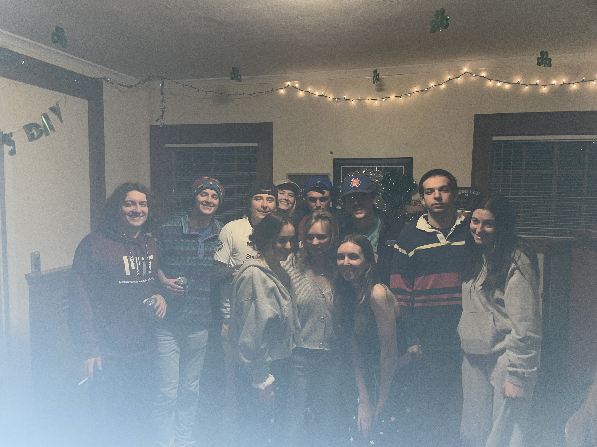

```{r setup, include=FALSE}
knitr::opts_chunk$set(echo = FALSE)
```

```{r, include = FALSE}
# Loading in table and plot creation functions
source("imports_options_constants_functions.R")
source("barplot_ranks.R")
source("best_weeks.R")
source("boxplots.R")
source("extreme_scores.R")
source("histograms.R")
source("scatterplots.R")
source("summary_stats.R")

# Extra libraries, objects, and options for this report

library(patchwork)

library(gridExtra)
tt <- ttheme_default(colhead = list(fg_params = list(parse = FALSE)))

options(knitr.kable.NA = "")
```

```{r}
# rename_quantiles() gives nicer names for the summary_stats() table output
rename_quantiles <- function(df) {
    df %>%
        rename(`Min.` = min,
               `1st Qu.` = quant1,
               Median = med,
               Mean = mean,
               `3rd Qu.` = quant3,
               `Max.` = max) %>%
        {
            if ("trim_mean" %in% colnames(.)) {
                (.) %>%
                    rename(`Trimmed Mean` = trim_mean)
            } else {
                (.)
            }
        }
}
```

```{r}
# kable_nice_names() is a wrapper function for kable::knitr() function, making the column names nices
kable_nice_names <- function(df, digits = 1, ...) {
    df %>%
        knitr::kable(digits = digits, col.names = str_to_title(str_replace_all(names(.), "_", " ")), ...)
}
```

# 1) Introduction




Hey friends, more crossword graphs incoming! This has been months in the coming, so I appreciate everyone's patience and sticking by my side. This report is bigger and better than ever, if you ignore the fact that I barely did anything except plug in the new data and wrote significantly less than the first 2 reports, simply because I didn't have the time and didn't really want to. But here we go!

This installment covers from 12/8/21 - 7/23/22 (228 days), with the first report covering up to 12/28/21 and the second report covering up to 2/14/22.

As is probably expected, there has been a noticeable decline in the average number of solvers per puzzle. This leads to probably unexpected results, such as yours truly absolutely climbing up the power rankings. I don't have anything else really to add about this except don't yell at me for my disproportionate amount of top-3 finishes.

This report will be structured as follows:

1. Introduction
2. Methodology
3. Summary
4. Profiles
5. Declarations of Funding and Competing Interests
6. Acknowledgements
7. Appendix: Summary Stats and Graphs for Each Weekday

With all that being said, let's get it rolling!

# 2) Methodology

Just go look at the the Methodology section in the first 2 reports if you're really that interested.

# 3) Summary

## 3.1) Overall Trends

```{r}
# Histogram and summary stats for overall distribution
overall_time_hist <- histogram_for_time(crossword_scores, time_var = "time",
                                        group_by_person = FALSE, facet_by_weekday = FALSE)

summary_stats_time <- crossword_scores$time %>%
    summary %>%
    enframe(name = "Stat", value = "Time (sec)") %>%
    mutate(`Time (sec)` = round(as.numeric(`Time (sec)`), 1))

grid.arrange(overall_time_hist, tableGrob(summary_stats_time, row = NULL, theme=tt),
             ncol = 2, widths = c(5, 2))
```

As a unit, crossword times are improving, with the median improving from 82 to `r round(summary(crossword_scores$time)[["Median"]], 1)` seconds, the mean dropping from 112.3 to `r round(summary(crossword_scores$time)[["Mean"]], 1)` seconds, and the lower and upper quartiles dipping from 48.8 to `r round(summary(crossword_scores$time)[["1st Qu."]], 1)` seconds and 140 to `r round(summary(crossword_scores$time)[["3rd Qu."]], 1)` seconds, respectively.

We also have a new record minimum score, with addieavery's previous record of 11 seconds on 1/5 being bested 4 times, all by liam, with his 7-second solve on 4/24 taking top spot.

```{r message = FALSE}
# Scatterplot of overall times
scatterplot_for_time(crossword_scores, time_var = "time",
                     group_by_person = FALSE, facet_by_weekday = FALSE,
                     add_mean_line = TRUE) +
    geom_vline(xintercept = as_date("2021-12-28"),
               linetype = "dotted") +
    geom_vline(xintercept = as_date("2022-02-14"),
               linetype = "dotted")
```

```{r}
# Overall best week
best_weeks(crossword_scores, time_var = "time", group_by_person = FALSE) %>%
    select(-crossword_week) %>%
    kable_nice_names(caption = "Overall Best Week")
```

We continue to improve as a whole!

## 3.2) Individuals' Scores

```{r fig.height = 20,  fig.width = 28, warning = FALSE, message = FALSE}
## Plots of individual distributions

# Boxplots
grouped_time_boxplot <- boxplot_for_time(crossword_scores, time_var = "time",
                                         group_by_person = TRUE, facet_by_weekday = FALSE)
grouped_time_z_boxplot <- boxplot_for_time(crossword_scores, time_var = "time_z",
                                           group_by_person = TRUE, facet_by_weekday = FALSE)

# Histograms / Barplots
grouped_time_hist <- histogram_for_time(crossword_scores, time_var = "time",
                                        group_by_person = TRUE, facet_by_weekday = FALSE)
grouped_time_z_hist <- histogram_for_time(crossword_scores, time_var = "time_z",
                                          group_by_person = TRUE, facet_by_weekday = FALSE)
grouped_rank_barplot <- barplot_for_rank(crossword_scores, facet_by_weekday = FALSE,
                                         add_bar_label = TRUE)

# Scatterplots
grouped_time_scatter <- scatterplot_for_time(crossword_scores, time_var = "time",
                                             group_by_person = TRUE, facet_by_weekday = FALSE,
                                             add_mean_line = TRUE)
grouped_time_z_scatter <- scatterplot_for_time(crossword_scores, time_var = "time_z",
                                               group_by_person = TRUE, facet_by_weekday = FALSE,
                                               add_mean_line = TRUE)
grouped_rank_scatter <- scatterplot_for_time(crossword_scores, time_var = "rank",
                                             group_by_person = TRUE, facet_by_weekday = FALSE,
                                             add_mean_line = TRUE)

# Combining all 8 plots
(grouped_time_boxplot + grouped_time_z_boxplot) /
    (grouped_time_hist + grouped_time_scatter) /
    (grouped_time_z_hist + grouped_time_z_scatter) /
    (grouped_rank_barplot + grouped_rank_scatter)
```

When looking at the `Individual Crossword Daily Ranks by Date` plot in the bottom-right, most people's average rank is plummeting simply due to to the decreasing number of solvers per puzzle, although if you want to exercise extreme cognitive dissonance maybe we're all getting impossibly better simultaneously!

Note that in the above boxplots and histograms, the dotted lines represent the overall average, while in the scatterplots, the dashed lines represent each participant's personal average.

\newpage

```{r}
# Frequency count for each person in each rank
map_dfr(names_vec,
        function(name_in) {
            
            num_days <- crossword_scores %>%
                .$date %>%
                unique %>%
                length
            
            crossword_scores %>%
                filter(name == name_in) %>%
                .$rank %>%
                table %>% # frequency count
                as_tibble %>%
                rename(rank = ".") %>%
                mutate(total_rank_score = n * (length(names_vec) - as.integer(rank) + 1)) %>%
                bind_rows(
                    tibble(rank = "N/A",
                           n = num_days - sum(.$n),
                           total_rank_score = 0)
                ) %>%
                mutate(name = name_in,
                       total_score = sum(total_rank_score))
        }) %>%
    pivot_wider(id_cols = c(name, total_score), names_from = rank, values_from = n) %>%
    replace(is.na(.), 0) %>%
    arrange(desc(total_score)) %>%
    select(name, as.character(1:length(names_vec)), "N/A", total_score) %>%
    kable_nice_names(digits = 0, caption = "Rankings of Each Player")
```

The above table displays the number of times each player has finished at each rank, with the `Total Score` column being the sum of points if a 1st-place finish gets 12 points, 2nd-place gets 11, ..., 12th-place gets 1 point.

annabeans is officially our smartest friend. Congrats!!

## 3.3) Improvements in Most Recent Period

```{r}
# Average time before and after a given date (date is inclusive in first range)
cutoff_date <- as_date("2022-02-14")
```

This section will explore performance before (inclusive) and after `r format(cutoff_date, format = "%m/%d/%y")`, which is the final date in which data was included for Edition 2.

```{r}
# Calculating scores before and after cutoff_date
cutoff_scores <- crossword_scores %>%
    mutate(pre_cutoff = ifelse(date <= cutoff_date, "pre_cutoff", "post_cutoff")) %>%
    group_by(name, pre_cutoff) %>%
    summarize(avg_time = mean(time),
              avg_time_z = mean(time_z),
              avg_rank = mean(rank),
              .groups = "drop") %>%
    pivot_wider(id_cols = name, names_from = pre_cutoff, values_from = starts_with("avg_")) %>%
    mutate(change_in_time = avg_time_post_cutoff - avg_time_pre_cutoff,
           change_in_time_z = avg_time_z_post_cutoff - avg_time_z_pre_cutoff,
           change_in_rank = avg_rank_post_cutoff - avg_rank_pre_cutoff) %>%
    select(name,
           avg_time_pre_cutoff, avg_time_post_cutoff, change_in_time,
           avg_time_z_pre_cutoff, avg_time_z_post_cutoff, change_in_time_z,
           avg_rank_pre_cutoff, avg_rank_post_cutoff, change_in_rank) %>%
    rename_with(~str_replace(.x, "_cutoff", str_c("-", format(cutoff_date, "%m/%d"))))
```

```{r}
# Change in times
cutoff_scores %>%
    select(name, starts_with("avg_time_p"), change_in_time) %>%
    kable_nice_names(digits = 1, caption = "Change in Average Time")
```


The biggest improvement in times once again goes to cnewt, with an average `r cutoff_scores %>% filter(name == "cnewt") %>% .$change_in_time %>% abs %>% round`-second improvement in this third period.

\newpage

```{r}
# Change in z-scores
cutoff_scores %>%
    select(name, starts_with("avg_time_z_p"), change_in_time_z) %>%
    rename_with(~str_replace(.x, "time_z", "z-score")) %>%
    kable_nice_names(digits = 2, caption = "Change in Average Z-Score")
```

mike dale holds the biggest improvement in z-scores, with an average of a `r cutoff_scores %>% filter(name == "mike dale") %>% .$change_in_time_z %>% abs %>% round(2)` improvement per puzzle.

```{r}
# Change in rank
cutoff_scores %>%
    select(name, starts_with("avg_rank_p"), change_in_rank) %>%
    kable_nice_names(digits = 1, caption = "Change in Average Rank")
```

In terms of rank, mike dale showed the biggest average movement up the standings, with an average improvement per day of `r cutoff_scores %>% filter(name == "mike dale") %>% .$change_in_rank %>% abs %>% round(1)`. Yay for doing the puzzle everyday!!

# 4) Profiles

As with Editions 1 and 2, everyone has their own page in this report with their own statistics and graphs. Due to lack of time and motivation, I have not included individualized analyses for y'all's pages this time, although maybe if there is significant backlash I will next time.

Note that in all the plots in this section, the dotted and dashed lines represent the person's personal average.

```{r}
## Functions for profiles

# profile_plots() plots the individual distributions
profile_plots <- function(name_in) {

    crossword_scores_name <- crossword_scores %>%
        filter(name == name_in)

    # Histograms / Barplots
    time_hist <- histogram_for_time(crossword_scores_name, time_var = "time",
                                    group_by_person = TRUE, facet_by_weekday = FALSE)
    time_z_hist <- histogram_for_time(crossword_scores_name, time_var = "time_z",
                                    group_by_person = TRUE, facet_by_weekday = FALSE)
    rank_barplot <- barplot_for_rank(crossword_scores_name, facet_by_weekday = FALSE,
                                     add_bar_label = TRUE)

    # Scatterplots
    time_scatter <- scatterplot_for_time(crossword_scores_name, time_var = "time",
                                         group_by_person = TRUE, facet_by_weekday = FALSE,
                                         add_mean_line = TRUE)
    time_z_scatter <- scatterplot_for_time(crossword_scores_name, time_var = "time_z",
                                         group_by_person = TRUE, facet_by_weekday = FALSE,
                                         add_mean_line = TRUE)
    rank_scatter <- scatterplot_for_time(crossword_scores_name, time_var = "rank",
                                         group_by_person = TRUE, facet_by_weekday = FALSE,
                                         add_mean_line = TRUE)

    # Combining all 6 plots
    (time_hist + time_z_hist + rank_barplot) /
        (time_scatter + time_z_scatter + rank_scatter)
}

# profile_summary_stats() returns a table of individual summary stats
profile_summary_stats <- function(name_in) {
    bind_rows(
        summary_stats(crossword_scores, "time"),
        summary_stats(crossword_scores, "time_z"),
        summary_stats(crossword_scores, "rank")
    ) %>%
        filter(name == name_in) %>%
        mutate(metric = c("Time", "Z-Score", "Rank")) %>%
        select(metric, everything(), -name) %>%
        rename_quantiles
}

# profile_best_weeks() returns a table of the best individual week
profile_best_weeks <- function(name_in) {
    best_weeks(crossword_scores %>%
                   filter(name == name_in),
               time_var = "time_z", group_by_person = FALSE) %>%
        select(-crossword_week) %>%
    rename(`z-score` = time_z,
           `week_avg_z-score` = week_avg_time_z)
}
# 
# # caption_generator() returns the caption for the table
# caption_generator <- function(name_in, table_type = c("summary_stats", "best_weeks")) {
#     str_c(name_in,
#           ifelse(str_sub(name_in, start = -1) == "s",
#                  "'",
#                  "'s"),
#           " ",
#           ifelse(table_type == "summary_stats",
#                  "Score Metrics",
#                  "Best Week by Z-Score"))
# }
```

\newpage

## 4.1) addieavery

```{r fig.height = 12,  fig.width = 18, warning = FALSE, message = FALSE}
profile_plots("addieavery")
```

```{r}
profile_summary_stats("addieavery") %>%
    kable_nice_names(digits = 2)
```

```{r}
profile_best_weeks("addieavery") %>%
    kable_nice_names(digits = 2)
```

\newpage

## 4.2) annabeans

```{r fig.height = 12,  fig.width = 18, warning = FALSE, message = FALSE}
profile_plots("annabeans")
```

```{r}
profile_summary_stats("annabeans") %>%
    kable_nice_names(digits = 2)
```

```{r}
profile_best_weeks("annabeans") %>%
    kable_nice_names(digits = 2)
```

\newpage

## 4.3) Bahsdaddy

```{r fig.height = 12,  fig.width = 18, warning = FALSE, message = FALSE}
profile_plots("Bahsdaddy")
```

```{r}
profile_summary_stats("Bahsdaddy") %>%
    kable_nice_names(digits = 2)
```

```{r}
profile_best_weeks("Bahsdaddy") %>%
    kable_nice_names(digits = 2)
```

\newpage

## 4.4) cnewt

```{r fig.height = 12,  fig.width = 18, warning = FALSE, message = FALSE}
profile_plots("cnewt")
```

```{r}
profile_summary_stats("cnewt") %>%
    kable_nice_names(digits = 2)
```

```{r}
profile_best_weeks("cnewt") %>%
    kable_nice_names(digits = 2)
```

\newpage

## 4.5) crossword spank

```{r fig.height = 12,  fig.width = 18, warning = FALSE, message = FALSE}
profile_plots("crossword spank")
```

```{r}
profile_summary_stats("crossword spank") %>%
    kable_nice_names(digits = 2)
```

```{r}
profile_best_weeks("crossword spank") %>%
    kable_nice_names(digits = 2)
```

\newpage

## 4.6) elliefich

```{r fig.height = 12,  fig.width = 18, warning = FALSE, message = FALSE}
profile_plots("elliefich")
```

```{r}
profile_summary_stats("elliefich") %>%
    kable_nice_names(digits = 2)
```

```{r}
profile_best_weeks("elliefich") %>%
    kable_nice_names(digits = 2)
```

\newpage

## 4.7) grapefruit jones

```{r fig.height = 12,  fig.width = 18, warning = FALSE, message = FALSE}
profile_plots("grapefruit jones")
```

```{r}
profile_summary_stats("grapefruit jones") %>%
    kable_nice_names(digits = 2)
```

```{r}
profile_best_weeks("grapefruit jones") %>%
    kable_nice_names(digits = 2)
```

\newpage

## 4.8) katherine

```{r fig.height = 12,  fig.width = 18, warning = FALSE, message = FALSE}
profile_plots("katherine")
```

```{r}
profile_summary_stats("katherine") %>%
    kable_nice_names(digits = 2)
```

```{r}
profile_best_weeks("katherine") %>%
    kable_nice_names(digits = 2)
```

\newpage

## 4.9) liam

```{r fig.height = 12,  fig.width = 18, warning = FALSE, message = FALSE}
profile_plots("liam")
```

```{r}
profile_summary_stats("liam") %>%
    kable_nice_names(digits = 2)
```

```{r}
profile_best_weeks("liam") %>%
    kable_nice_names(digits = 2)
```

\newpage

## 4.10) meredithat

```{r fig.height = 12,  fig.width = 18, warning = FALSE, message = FALSE}
profile_plots("meredithat")
```

```{r}
profile_summary_stats("meredithat") %>%
    kable_nice_names(digits = 2)
```

<!-- ```{r} -->
<!-- profile_best_weeks("meredithat") %>% -->
<!--     kable_nice_names(digits = 2) -->
<!-- ``` -->

\newpage

## 4.11) mike dale

```{r fig.height = 12,  fig.width = 18, warning = FALSE, message = FALSE}
profile_plots("mike dale")
```

```{r}
profile_summary_stats("mike dale") %>%
    kable_nice_names(digits = 2)
```

```{r}
profile_best_weeks("mike dale") %>%
    kable_nice_names(digits = 2)
```

\newpage

## 4.12) mikemikemike

```{r fig.height = 12,  fig.width = 18, warning = FALSE, message = FALSE}
profile_plots("mikemikemike")
```

```{r}
profile_summary_stats("mikemikemike") %>%
    kable_nice_names(digits = 2)
```

```{r}
profile_best_weeks("mikemikemike") %>%
    kable_nice_names(digits = 2)
```

\newpage


# 5) Declarations of Funding and Competing Interests

I am in the pockets of all the prominent DC lobbyists. I have absolutely no morals and values to speak of.


# 6) Acknowledgements

This one goes out to my sister Hannah because she turned 8 yesterday (7/22), and because she is my best friend in the whole wide world. Shame on y'all for not wishing her a happy birthday.

\newpage


# 7) Appendix: Summary Stats Tables and

## 7.1) Summary Stats and Graphs for Each Weekday

The following tables give each person's quartiles with respect to time, z-score, and daily rank. These are the same data presented individually in each person's subsection of the "Profiles" Section.

### 7.1.1) Summary Stats for Time

```{r}
# Summary stats for each person's times
summary_stats(crossword_scores, "time") %>%
    rename_quantiles %>%
    kable_nice_names
```

### 7.1.2) Summary Stats for Z-Score

```{r}
# Summary stats for each person's z-scores
summary_stats(crossword_scores, "time_z") %>%
    rename_quantiles %>%
    kable_nice_names(digits = 2)
```

\newpage

### 7.1.3) Summary Stats for Rank

```{r}
# Summary stats for each person's ranks
summary_stats(crossword_scores, "rank") %>%
    rename_quantiles %>%
    kable_nice_names
```

## 7.2) Graphs for Each Weekday

### 7.2.1) Distribution of Overall Times

```{r fig.height = 9,  fig.width = 11}
# Histogram and boxplot of group's times for each weekday
hist_for_time <-
    histogram_for_time(crossword_scores, time_var = "time",
                       group_by_person = FALSE, facet_by_weekday = TRUE) +
    labs(title = NULL)

box_for_time <-
    boxplot_for_time(crossword_scores, time_var = "time",
                     group_by_person = FALSE, facet_by_weekday = TRUE) +
    labs(title = NULL)

hist_for_time +
    box_for_time &
    plot_annotation(title = str_c("Overall Crossword Times, Grouped by Weekday",
                                  sep = "\n")) &
    theme_fivethirtyeight_mod()
```

### 7.2.2) Distribution of Individual Ranks

```{r fig.height = 9,  fig.width = 14, warning = FALSE, message = FALSE}
# Barplots for each person's daily rank for each weekday
barplot_for_rank(crossword_scores, facet_by_weekday = TRUE, add_bar_label = TRUE)
```


