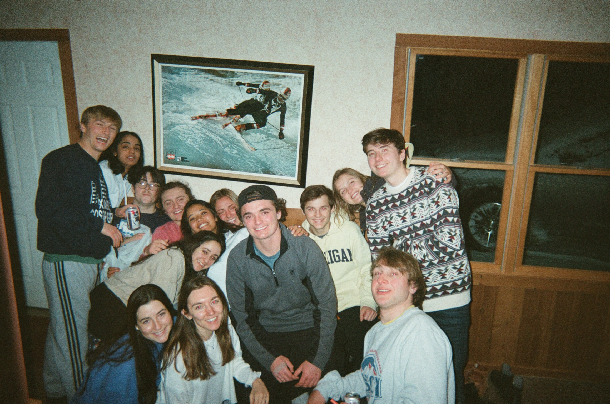

```{r setup, include=FALSE}
knitr::opts_chunk$set(echo = FALSE, warning = FALSE)
```

```{r, include = FALSE}
# Loading in table and plot creation functions
source("imports_options_constants_functions.R")
source("barplot_ranks.R")
source("best_weeks.R")
source("boxplots.R")
source("extreme_scores.R")
source("histograms.R")
source("scatterplots.R")
source("summary_stats.R")
source("total_scores_by_pos.R")

# Extra libraries, objects, and options for this report

library(patchwork)

library(gridExtra)
tt <- ttheme_default(colhead = list(fg_params = list(parse = FALSE)))

options(knitr.kable.NA = "")
```

```{r}
# rename_quantiles() gives nicer names for the summary_stats() table output
rename_quantiles <- function(df) {
    df %>%
        rename(`Min.` = min,
               `1st Qu.` = quant1,
               Median = med,
               Mean = mean,
               `3rd Qu.` = quant3,
               `Max.` = max) %>%
        {
            if ("trim_mean" %in% colnames(.)) {
                (.) %>%
                    rename(`Trimmed\nMean` = trim_mean)
            } else {
                (.)
            }
        }
}
```

```{r}
# kable_nice_setup() is a wrapper function for kable::knitr() function, making
# the column names nice, and some basic kableExtra styling
kable_nice_setup <- function(df, digits = 1, caption = NULL, font_size = NULL,
                             first_col_width = NULL, ...) {
    
    bold_caption <- NULL
    if (!is.null(caption)) {
        bold_caption <- str_glue("\\textbf{{{caption}}}")
    }
    
    df %>%
        column_to_rownames(colnames(df)[1]) %>%
        knitr::kable(digits = digits,
                     
                     # cleaning col names
                     col.names = (.) %>%
                         names() %>%
                         str_replace_all("_", " ") %>%
                         str_to_title() %>%
                         linebreak(align = "c"),
                     
                     
                     format = "latex", caption = bold_caption,
                     escape = FALSE, # escapes HTML
                     booktabs = TRUE, # formats the tables as kable() usually does
                     ...) %>%
        kable_styling(latex_options = c("hold_position"),
                      font_size = font_size) %>%
        
        # recreating striped columns
        # #f7f7f7 is default gray color in typical striped kable_styling table
        # (R = 247, G = 247, B = 247)
        row_spec(seq(from = 2, to = nrow(df), by = 2),
                 background = "#f7f7f7") %>%
    
        # emboldening col titles
        row_spec(0, bold = TRUE) %>%
        
        # emboldening first column
        column_spec(1, width = first_col_width, bold = TRUE)
}
```

```{r}
# format_kable_caption_num() takes a dataframe and a col which has only one
# unique value, and returns that value rounded to 1 digit for usage in kable
# captions
format_kable_caption_num <- function(df, col_name) {
    df %>%
        slice(1) %>%
        pull(!!col_name) %>%
        round(1) %>%
        as.character()
}
```


```{r}
# format_date_col() converts the column entitled "date" to a more readable formate
# For example, 2023-01-31 -> Jan 31, 2023
format_date_col <- function(df) {
    df %>%
        mutate(date = format(date, "%b %d, %Y"))
}
```


# 1) Introduction



Hello friends who I cherish and miss very dearly!! Great news: more crossword data, this time bigger and better than ever!

Not only does this report document over 150 more puzzles than the 4th report, but the New York Times Games app has added perhaps the greatest feature in the history of features. You can now go back and look at old crossword leaderboard pages, which is huge news for me! I usually collect y'all's crossword times by screenshotting the leaderboard several times daily, but this method meant I was bound to miss some scores if people solved the puzzle closer to when its availability expires. Now I can be confident I'm not missing anyone's scores!! Furthermore, I used this feature to look at all the leaderboards since the beginning of data collection on 12/8/21, and updated all scores that were missing from my data file, including adding the scores of those of us who hadn't been included since the beginning. For example, I have now added all of jakewal99's scores since 12/8/21, as well as 2 newcomers, matayae1318 (friend from softball Ellie) and Els59 (Allie). Woohoo!! I really made elite use of a 10-hour flight from SF to Dublin. God I love more complete data.

I should note though that with this additional data from the past, previous ranks and time-adjusted scores have changed for puzzles included in previous reports. For example, jakewal99 is now the co-winner of the 12/14/21 puzzle, alongside grapefruit jones.

This installment covers from 12/8/21 - 7/8/23 (577 puzzles), with the first report covering up to 12/28/21, the second report covering up to 2/14/22, the third report covering up to 7/23/22, and the fourth report covering up to 2/4/23. As mentioned in the Introduction in the 4th edition, the 12/8/22 puzzle was skipped for data collection purposes, as it coincided with [1,100 New York Times Union employees striking](https://www.reuters.com/business/media-telecom/new-york-times-staffers-walk-out-after-contract-talks-fail-2022-12-08/), and this is officially a pro-labor data analysis project.

This report will be structured as follows:

1. Introduction
2. Methodology
3. Summary
4. Profiles
5. Declarations of Funding and Competing Interests
6. Acknowledgements
7. Appendix: Z-Score Explanation, Summary Stats, and Graphs for Each Weekday

# 2) Methodology

No methodological updates have been made since the first two reports, so go look there if you're really that interested. Or check out [my GitHub](https://github.com/michaelhymowitz/Sylvan-Crossword-Report) if you wanna see the super amazing sick code.

# 3) Summary

## 3.1) Overall Trends

```{r}
# Histogram and summary stats for overall distribution
summary_stats_time <- crossword_scores$time %>%
    summary %>%
    enframe(name = "Stat", value = "Time (sec)") %>%
    mutate(`Time (sec)` = round(as.numeric(`Time (sec)`), 1))

histogram_for_time(crossword_scores, time_var = "time",
                                        group_by_person = FALSE, facet_by_weekday = FALSE) +
    
    # adding table on top of plot
    annotation_custom(tableGrob(summary_stats_time, row = NULL, theme=tt),
                      xmin = 420, xmax = 660, ymin = 400, ymax = 1000)
```

Our group's crossword times have continued to improve in this most recent interval, with the median improving from 60 to `r round(summary(crossword_scores$time)[["Median"]], 1)` seconds, the mean dropping from 82.9 to `r round(summary(crossword_scores$time)[["Mean"]], 1)` seconds, and the lower and upper quartiles dipping from 39 to `r round(summary(crossword_scores$time)[["1st Qu."]], 1)` seconds and 102 to `r round(summary(crossword_scores$time)[["3rd Qu."]], 1)` seconds, respectively.

liam continues to own record for the quickest puzzle solve with his 6-second solve on the 9/18/22 puzzle, although with the inclusion of prior data, he is now joined by jakewal99, who likewise had a 6-second solve on the 1/5/22 puzzle.

```{r message = FALSE}
vlines_for_report_dates <- c("2021-12-28", "2022-02-14", "2022-07-23", "2023-02-04") %>%
    as_date() %>%
    map2(1:length(.), function(report_date, report_num) {
        list(
            geom_vline(xintercept = report_date, linetype = "dotted",
                       color = "forestgreen", linewidth = 1),
            annotate(geom = "label", x = report_date, y = 300,
                     size = 2,
                     label =
                         str_glue("Report {report_num}\n{format(report_date, '%m/%d/%y')}"),
                     color = "forestgreen")
        )
})

# Scatterplot of overall times
scatterplot_for_time(crossword_scores, time_var = "time",
                     group_by_person = FALSE, facet_by_weekday = FALSE,
                     add_mean_line = TRUE) +
    vlines_for_report_dates
```

Look at that superimposed local polynomial regression fit on the scatterplot trend downwards lets goooooooo

\vspace{0.5in}

```{r}
# Overall best week
ovr_best_week_raw <- best_weeks(crossword_scores, time_var = "time", group_by_person = FALSE)

ovr_best_week_raw %>%
    select(date, weekday, time) %>%
    format_date_col() %>%
    kable_nice_setup(caption =
                         str_c("Overall Best Week - Average Time:",
                               format_kable_caption_num(ovr_best_week_raw, "week_avg_time"),
                               "Seconds",
                               sep = " "),
                     linesep = "")
```

We have a new best overall week! Cool!!

## 3.2) Individuals' Scores

```{r fig.height = 20,  fig.width = 34, warning = FALSE, message = FALSE}
## Plots of individual distributions

# Boxplots
grouped_time_boxplot <- boxplot_for_time(crossword_scores, time_var = "time",
                                         group_by_person = TRUE, facet_by_weekday = FALSE)
grouped_time_z_boxplot <- boxplot_for_time(crossword_scores, time_var = "time_z",
                                           group_by_person = TRUE, facet_by_weekday = FALSE)

# Histograms / Barplots
grouped_time_hist <- histogram_for_time(crossword_scores, time_var = "time",
                                        group_by_person = TRUE, facet_by_weekday = FALSE)
grouped_time_z_hist <- histogram_for_time(crossword_scores, time_var = "time_z",
                                          group_by_person = TRUE, facet_by_weekday = FALSE)
grouped_rank_barplot <- barplot_for_rank(crossword_scores, facet_by_weekday = FALSE,
                                         facet_by_num_solvers = FALSE,
                                         add_bar_label = TRUE)

# Scatterplots
grouped_time_scatter <- scatterplot_for_time(crossword_scores, time_var = "time",
                                             group_by_person = TRUE, facet_by_weekday = FALSE,
                                             add_mean_line = TRUE)
grouped_time_z_scatter <- scatterplot_for_time(crossword_scores, time_var = "time_z",
                                               group_by_person = TRUE, facet_by_weekday = FALSE,
                                               add_mean_line = TRUE)
grouped_rank_scatter <- scatterplot_for_time(crossword_scores, time_var = "rank",
                                             group_by_person = TRUE, facet_by_weekday = FALSE,
                                             add_mean_line = TRUE)

# Combining all 8 plots
(grouped_time_boxplot + grouped_time_z_boxplot) /
    (grouped_time_hist + grouped_time_scatter) /
    (grouped_time_z_hist + grouped_time_z_scatter) /
    (grouped_rank_barplot + grouped_rank_scatter)
```

Note that in the above boxplots and histograms, the dotted lines represent the overall average, while in the scatterplots, the dashed lines represent each participant's personal average.

\newpage

```{r}
# create_total_scores_by_pos_kable() creates the kable for frequency count of
# each person either by rank or number of competitors bested
create_total_scores_by_pos_kable <- function(crossword_scores_in, score_var) {
    
    # Frequency count for each person
    total_scores_by_pos_raw <- create_total_scores_by_pos_table(crossword_scores_in, score_var)
    
    # Max cell value in total scores table (will always be the highest total score)
    max_cell_value <- total_scores_by_pos_raw %>%
        select(where(is.numeric)) %>%
        pivot_longer(everything(), names_to = "rank", values_to = "score") %>%
        .$score %>%
        max() %>%
        unique() %>%
        `+`(1) # to account for the value of 0
    
    # First col_name is name
    col_names_to_color <- colnames(total_scores_by_pos_raw)[-1]
    
    # Creating color palette for each col
    total_scores_by_pos_background_colors <- map(col_names_to_color, function(col_name) {
        
        col_name_values <- total_scores_by_pos_raw %>%
            pull(col_name)
        
        # manually formatting the case of a max value of 0 or 1 because otherwise
        # the colors selected are non-intuitive
        {if (max(col_name_values) == 0) {
            
            # Using the lightest color in the table
            heat.colors(max_cell_value, rev = TRUE) %>%
                .[1]
            
        } else if (max(col_name_values) == 1) {
            
            # Using the lightest and darkest colors in the table
            max_cell_value %>%
                heat.colors(rev = TRUE) %>%
                .[c(1, length(.))]
            
        } else {
            
            # Using the typical palette dictated by the col's values
            col_name_values %>%
                max() %>%
                unique() %>%
                `+`(1) %>% # to account for the value of 0
                heat.colors(rev = TRUE)
        }} %>%
            .[col_name_values + 1] # `+1 to account for the value of 0
    }) %>%
        set_names(col_names_to_color)
    
    # Formatting table
    total_scores_by_pos_df <- total_scores_by_pos_raw %>%
        rename(`Total\nScore` = total_score) %>%
        kable_nice_setup(digits = 0,
                         caption = str_c(
                             if_else(
                                 score_var == "rank",
                                 "Rankings of",
                                 "Number of Competitors Bested for"
                             ),
                             "Each Player",
                             sep = " "
                         ),
                         font_size = 9.5,
                         first_col_width = "1.1in")
    
    # Adding background colors for each col
    for (col_name in col_names_to_color) {
        total_scores_by_pos_df <- total_scores_by_pos_df %>%
            column_spec(which(col_name == col_names_to_color) + 1,  # need `+ 1` due to name col
                        background = total_scores_by_pos_background_colors[[col_name]],
                        
                        # adding border around N/A col, which also adds as a border
                        # to the left of the Total Score col
                        border_left = col_name == "N/A",
                        border_right = col_name == "N/A")
    }
    
    return(total_scores_by_pos_df)
}
```


```{r}
# Frequency count for each person in each rank
create_total_scores_by_pos_kable(crossword_scores, "rank")
```

The above table displays the number of times each player has finished at each rank, with the `Total Score` column being the sum of points if a 1st-place finish gets 14 points, 2nd-place gets 13, ..., 14th-place gets 1 point. Not completing a puzzle accrues 0 points. Note that there exists the 14th-place column despite no one occupying a spot in this column because there are 14 possible ranks, due to there being 14 competitors. There just has not been a single day where all 14 competitors completed a puzzle.

annabeans has reclaimed her place at the summit of the Sylvan Crossword Report. Must be because she watches Survivor.

\newpage

## 3.3) Individual Rankings by Number of Players Beaten per Puzzle

As discussed in Edition 4, I have created an alternative ranking system to give a different perspective on the leaderboard, by instead scoring players per puzzle based on how many fellow competitors they beat on a given puzzle, as opposed to the typical ranking system, which ranks solves based on how many other players bested a given person's solve time. For example, my 1st-place solve on 6/9/22 would be worth 5 points, as I beat 4 other competitors, and liam's 1st-place solve on 3/12/22 would be worth 12 points, as he beat 11 other competitors. This alternative ranking system is designed to reward players who achieved higher ranks in puzzles in which there were more competitors, and hurts players like myself who have racked up high finishes through puzzles with lower overall participation.

The following tables displays the number of times each player beat a given number of fellow competitors, ranging from 13, indicating a player bested 13 other players, to 0, indicating a player bested no other players (i.e., finished last), with the `Total Score` column being the sum of points if beating 13 other players gets 14 points, beating 12 other players gets 13 points, ..., beating 0 other players gets 1 point. Not completing a puzzle accrues 0 points.

```{r}
# Frequency count for each person in each number of competitors bested
create_total_scores_by_pos_kable(crossword_scores, "num_people_beaten")
```

As with Edition 4, according to this scoring system, liam remains the frontrunner, annabeans remains in 2nd place, and Bahsdaddy has moved up to 3rd place.

Note that the rest of the report will continue with using raw ranks, as opposed to number of competitors beaten, due to ease of interpretability, and due to the fact that this scoring system is also imperfect. For example, if a person finishes 1st out of 3 one day, and then finishes 1st out of 8 the next day, their total number of competitors beaten will have dropped by 5, which seems awfully variable for a player who finished 1st in back-to-back days.

\newpage

## 3.4) Improvements in Most Recent Period

```{r}
# Average time before and after a given date (date is inclusive in first range)
cutoff_date <- as_date("2023-02-04")
```

This section will explore performance before (inclusive) and after `r format(cutoff_date, format = "%m/%d/%y")`, which is the final date in which data was included for Edition 4.

```{r}
# Calculating scores before and after cutoff_date
cutoff_scores <- crossword_scores %>%
    mutate(pre_cutoff = ifelse(date <= cutoff_date, "pre_cutoff", "post_cutoff")) %>%
    group_by(name, pre_cutoff) %>%
    summarize(avg_time = mean(time),
              avg_time_z = mean(time_z),
              avg_rank = mean(rank),
              .groups = "drop") %>%
    pivot_wider(id_cols = name, names_from = pre_cutoff, values_from = starts_with("avg_")) %>%
    mutate(change_in_time = avg_time_post_cutoff - avg_time_pre_cutoff,
           change_in_time_z = avg_time_z_post_cutoff - avg_time_z_pre_cutoff,
           change_in_rank = avg_rank_post_cutoff - avg_rank_pre_cutoff) %>%
    select(name,
           avg_time_pre_cutoff, avg_time_post_cutoff, change_in_time,
           avg_time_z_pre_cutoff, avg_time_z_post_cutoff, change_in_time_z,
           avg_rank_pre_cutoff, avg_rank_post_cutoff, change_in_rank) %>%
    rename_with(~str_replace(.x, "_cutoff", str_c("-", format(cutoff_date, "%m/%d")))) %>%
    rename_with(~str_replace(.x, "_((pre-)|(post-)|(in_))", "\n\\1"))
```

```{r}
# Change in times
cutoff_scores %>%
    select(name, starts_with("avg_time\np"), `change\nin_time`) %>%
    kable_nice_setup(digits = 1, caption = "Change in Average Time")
```

The biggest improvement in times goes to matayae1318, with an average `r cutoff_scores %>% filter(name == "matayae1318") %>% pull("change\nin_time") %>% abs %>% round`-second improvement in this 5th period.

\newpage

```{r}
# Change in z-scores
cutoff_scores %>%
    select(name, starts_with("avg_time_z\np"), `change\nin_time_z`) %>%
    rename_with(~str_replace(.x, "time_z", "z-score")) %>%
    kable_nice_setup(digits = 2, caption = "Change in Average Z-Score")
```

matayae1318 also holds the biggest improvement in z-scores, with an average of a `r cutoff_scores %>% filter(name == "matayae1318") %>% pull("change\nin_time_z") %>% abs %>% round(2)` z-score improvement per puzzle.

```{r}
# Change in rank
cutoff_scores %>%
    select(name, starts_with("avg_rank"), `change\nin_rank`) %>%
    kable_nice_setup(digits = 1, caption = "Change in Average Rank")
```

In terms of rank, crossword spank again showed the biggest average movement up the standings, with an average improvement per day of `r cutoff_scores %>% filter(name == "crossword spank") %>% pull("change\nin_rank") %>% abs %>% round(1)`.

# 4) Profiles

As with previous editions, everyone has their own page with statistics and graphs. Note that in all the plots in this section, the dotted and dashed lines represent the person's personal average. The *Personal Best Week by Average Z-Score* tables refer to an individual's best week in which they completed a puzzle every day (Sunday through Saturday), and is the week in which their average z-score per puzzle was their lowest.

```{r}
## Functions for profiles

# profile_plots() plots the individual distributions
profile_plots <- function(name_in) {

    crossword_scores_name <- crossword_scores %>%
        filter(name == name_in)

    # Histograms / Barplots
    time_hist <- histogram_for_time(crossword_scores_name, time_var = "time",
                                    group_by_person = TRUE, facet_by_weekday = FALSE)
    time_z_hist <- histogram_for_time(crossword_scores_name, time_var = "time_z",
                                    group_by_person = TRUE, facet_by_weekday = FALSE)
    rank_barplot <- barplot_for_rank(crossword_scores_name, facet_by_weekday = FALSE,
                                     facet_by_num_solvers = FALSE,
                                     add_bar_label = TRUE)

    # Scatterplots
    time_scatter <- scatterplot_for_time(crossword_scores_name, time_var = "time",
                                         group_by_person = TRUE, facet_by_weekday = FALSE,
                                         add_mean_line = TRUE)
    time_z_scatter <- scatterplot_for_time(crossword_scores_name, time_var = "time_z",
                                         group_by_person = TRUE, facet_by_weekday = FALSE,
                                         add_mean_line = TRUE)
    rank_scatter <- scatterplot_for_time(crossword_scores_name, time_var = "rank",
                                         group_by_person = TRUE, facet_by_weekday = FALSE,
                                         add_mean_line = TRUE)

    # Combining all 6 plots
    (time_hist + time_z_hist + rank_barplot) /
        (time_scatter + time_z_scatter + rank_scatter)
}

# profile_summary_stats() returns a table of individual summary stats
profile_summary_stats <- function(name_in) {
    bind_rows(
        summary_stats(crossword_scores, "time"),
        summary_stats(crossword_scores, "time_z"),
        summary_stats(crossword_scores, "rank")
    ) %>%
        filter(name == name_in) %>%
        mutate(metric = c("Time", "Z-Score", "Rank")) %>%
        select(metric, everything(), -name) %>%
        rename_quantiles()
}

# profile_best_weeks() returns a table of the best individual week
profile_best_weeks <- function(name_in) {
    crossword_scores %>%
        filter(name == name_in) %>%
        best_weeks(time_var = "time_z", group_by_person = FALSE) %>%
        select(-crossword_week) %>%
        format_date_col() %>%
        rename(`z-score` = time_z,
               `week_avg_z-score` = week_avg_time_z)
}

# kable_profile_summary_stats() converts a person's summary stats into a kable
kable_profile_summary_stats <- function(name_in) {
    name_in %>%
        profile_summary_stats() %>%
        kable_nice_setup(digits = 2, caption = "Summary Statistics", linesep = "")
}

# kable_profile_summary_stats() converts a person's best weeks into a kable
kable_profile_best_weeks <- function(name_in) {
    
    name_profile_best_weeks <- profile_best_weeks(name_in)
    
    # map connecting scoring method to scoring method with a player's average
    # during their best week
    score_cols_with_avgs <- tibble(scoring_method = c("time", "z-score", "rank")) %>%
        mutate(score_col_name_with_avg = map_chr(scoring_method, function(scoring_method) {
            name_profile_best_weeks %>%
                format_kable_caption_num(str_glue("week_avg_{scoring_method}")) %>%
                
                # bracket to remove first argument "."
                {str_glue("{str_to_title(scoring_method)}\n(Week Avg: {.})")}
        })) %>%
        pull(scoring_method, name = score_col_name_with_avg)

    
    name_profile_best_weeks %>%
        select(-starts_with("week_avg_")) %>%
        rename(score_cols_with_avgs) %>%
        kable_nice_setup(digits = 2,
                         caption = "Personal Best Week by Average Z-Score",
                         linesep = "")
}
```

\newpage

## 4.1) addieavery

```{r fig.height = 12,  fig.width = 18, warning = FALSE, message = FALSE}
name <- "addieavery"
profile_plots(name)
```

\vspace{0.25in}

```{r}
kable_profile_summary_stats(name)
```

\vspace{0.25in}

```{r}
kable_profile_best_weeks(name)
```

\newpage

## 4.2) annabeans

```{r fig.height = 12,  fig.width = 18, warning = FALSE, message = FALSE}
name <- "annabeans"
profile_plots(name)
```

\vspace{0.25in}

```{r}
kable_profile_summary_stats(name)
```

\vspace{0.25in}

```{r}
kable_profile_best_weeks(name)
```

\newpage

## 4.3) Bahsdaddy

```{r fig.height = 12,  fig.width = 18, warning = FALSE, message = FALSE}
name <- "Bahsdaddy"
profile_plots(name)
```

\vspace{0.25in}

```{r}
kable_profile_summary_stats(name)
```

\vspace{0.25in}

```{r}
kable_profile_best_weeks(name)
```

\newpage

## 4.4) cnewt

```{r fig.height = 12,  fig.width = 18, warning = FALSE, message = FALSE}
name <- "cnewt"
profile_plots(name)
```

\vspace{0.25in}

```{r}
kable_profile_summary_stats(name)
```

\vspace{0.25in}

```{r}
kable_profile_best_weeks(name)
```

\newpage

## 4.5) crossword spank

```{r fig.height = 12,  fig.width = 18, warning = FALSE, message = FALSE}
name <- "crossword spank"
profile_plots(name)
```

\vspace{0.25in}

```{r}
kable_profile_summary_stats(name)
```

\vspace{0.25in}

```{r}
kable_profile_best_weeks(name)
```

\newpage

## 4.6) elliefich

```{r fig.height = 12,  fig.width = 18, warning = FALSE, message = FALSE}
name <- "elliefich"
profile_plots(name)
```

\vspace{0.25in}

```{r}
kable_profile_summary_stats(name)
```

\vspace{0.25in}

```{r}
kable_profile_best_weeks(name)
```

\newpage

## 4.7) Els59

```{r fig.height = 12,  fig.width = 18, warning = FALSE, message = FALSE}
name <- "Els59"
profile_plots(name)
```

\vspace{0.25in}

```{r}
kable_profile_summary_stats(name)
```

\vspace{0.25in}

```{r}
kable_profile_best_weeks(name)
```

\newpage

## 4.8) grapefruit jones

```{r fig.height = 12,  fig.width = 18, warning = FALSE, message = FALSE}
name <- "grapefruit jones"
profile_plots(name)
```

\vspace{0.25in}

```{r}
kable_profile_summary_stats(name)
```

\vspace{0.25in}

```{r}
kable_profile_best_weeks(name)
```

\newpage

## 4.9) jakewal99

```{r fig.height = 12,  fig.width = 18, warning = FALSE, message = FALSE}
name <- "jakewal99"
profile_plots(name)
```

\vspace{0.25in}

```{r}
kable_profile_summary_stats(name)
```

\vspace{0.25in}

```{r}
kable_profile_best_weeks(name)
```

\newpage

## 4.10) katherine

```{r fig.height = 12,  fig.width = 18, warning = FALSE, message = FALSE}
name <- "katherine"
profile_plots(name)
```

\vspace{0.25in}

```{r}
kable_profile_summary_stats(name)
```

\vspace{0.25in}

```{r}
kable_profile_best_weeks(name)
```

\newpage

## 4.11) liam

```{r fig.height = 12,  fig.width = 18, warning = FALSE, message = FALSE}
name <- "liam"
profile_plots(name)
```

\vspace{0.25in}

```{r}
kable_profile_summary_stats(name)
```

\vspace{0.25in}

```{r}
kable_profile_best_weeks(name)
```

\newpage

## 4.12) matayae1318

```{r fig.height = 12,  fig.width = 18, warning = FALSE, message = FALSE}
name <- "matayae1318"
profile_plots(name)
```

\vspace{0.25in}

```{r}
kable_profile_summary_stats(name)
```

\vspace{0.25in}

```{r}
kable_profile_best_weeks(name)
```

\newpage

## 4.13) mike dale

```{r fig.height = 12,  fig.width = 18, warning = FALSE, message = FALSE}
name <- "mike dale"
profile_plots(name)
```

\vspace{0.25in}

```{r}
kable_profile_summary_stats(name)
```

\vspace{0.25in}

```{r}
kable_profile_best_weeks(name)
```

\newpage

## 4.14) mikemikemike

```{r fig.height = 12,  fig.width = 18, warning = FALSE, message = FALSE}
name <- "mikemikemike"
profile_plots(name)
```

\vspace{0.25in}

```{r}
kable_profile_summary_stats(name)
```

\vspace{0.25in}

```{r}
kable_profile_best_weeks(name)
```

\newpage

# 5) Declarations of Funding and Competing Interests

My Venmo is Michael-Hymowitz, if anyone is interested in bribery!


# 6) Acknowledgements

The 5th Edition is dedicated to [Hadley Wickham](https://en.wikipedia.org/wiki/Hadley_Wickham), the creator of the [tidyverse R package](https://www.tidyverse.org/), which is unironically probably the most beautiful thing I've ever seen.

\newpage

# 7) Appendix: Z-Score Explanation, Summary Stats, and Graphs for Each Weekday

## 7.1) Z-Score Explanation

The main statistics I look at in this analysis are time to crossword completion, z-scores of time to completion, and daily ranks. For those who do not know, a z-score is a data transformation that standardizes data to a [Standard Normal Gaussian distribution](https://en.wikipedia.org/wiki/Normal_distribution). Many distributions found in nature are assumed (correctly) to follow a Normal distribution. To amend a canonical example, consider:

* Puzzle A
  + Average solve time of 60 seconds to complete
  + You complete in 70 seconds
  + Your z-score is positive, as your solve time is above the mean
* Puzzle B
  + Average solve time of 150 seconds to complete
  + You complete in 130 seconds
  + Your z-score is negative, as your solve time is below the mean
  
Despite Puzzle B taking you longer to complete, you actually did *better* on that puzzle once we account for its observed difficulty, as you had a lower z-score on Puzzle B than Puzzle A. For further reading, if your into statistical theory and that whole jazz, take STATS 250 or 280, read the [standard score Wikipedia page](https://en.wikipedia.org/wiki/Standard_score), or write me a letter. **The tl;dr of this is that a z-score transformation standardizes the data to allow for comparison of completion times across different crossword puzzles relative to the mean and variance of each individual crossword puzzle.**

\newpage

## 7.2) Summary Stats

The following tables give each person's quartiles with respect to time, z-score, and daily rank. These are the same data presented individually in each person's subsection of the "Profiles" Section.

### 7.2.1) Summary Stats for Time

```{r}
# Summary stats for each person's times
summary_stats(crossword_scores, "time") %>%
    rename_quantiles() %>%
    kable_nice_setup(linesep = "")
```

### 7.2.2) Summary Stats for Z-Score

```{r}
# Summary stats for each person's z-scores
summary_stats(crossword_scores, "time_z") %>%
    rename_quantiles() %>%
    kable_nice_setup(digits = 2, linesep = "")
```

\newpage

### 7.2.3) Summary Stats for Rank

```{r}
# Summary stats for each person's ranks
summary_stats(crossword_scores, "rank") %>%
    rename_quantiles() %>%
    kable_nice_setup(linesep = "")
```

\newpage

## 7.3) Graphs for Each Weekday

### 7.3.1) Distribution of Overall Times per Weekday

```{r fig.height = 9,  fig.width = 11}
# Histogram and boxplot of group's times for each weekday
hist_for_time <-
    histogram_for_time(crossword_scores, time_var = "time",
                       group_by_person = FALSE, facet_by_weekday = TRUE) +
    labs(title = NULL)

box_for_time <-
    boxplot_for_time(crossword_scores, time_var = "time",
                     group_by_person = FALSE, facet_by_weekday = TRUE) +
    labs(title = NULL)

hist_for_time +
    box_for_time &
    plot_annotation(title = str_c("Overall Crossword Times, Grouped by Weekday",
                                  sep = "\n")) &
    theme_fivethirtyeight_mod()
```

### 7.3.2) Distribution of Individual Ranks per Weekday

```{r fig.height = 9, fig.width = 17, warning = FALSE, message = FALSE}
# Barplots for each person's daily rank for each weekday
barplot_for_rank(crossword_scores, facet_by_weekday = TRUE,
                 facet_by_num_solvers = FALSE, add_bar_label = TRUE)
```
